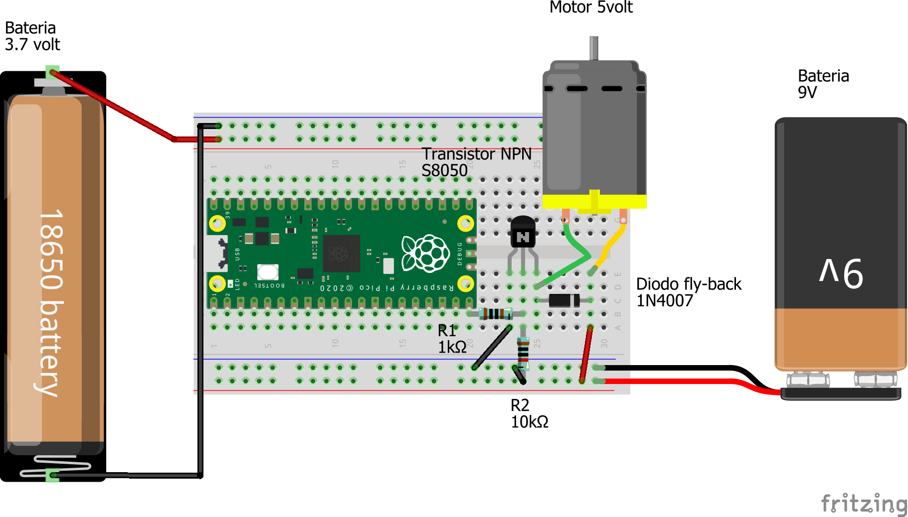

# 2526CL10_Motores_MotorCC

Panoiramica de Motores en robótica + Controlar Motores de Corriente Cntinua

Indice evolutivo del las clases del taller + libros y webs de referencia:

[GitHub - Jcspoza/2526_PyR_Index: Curso Programación y Robotica 2025 2026 - CMM BML](https://github.com/Jcspoza/2526_PyR_Index)

## 

---

## Proyecto completo-> en inicio de pruebas : sensor humedad suelo + bomba agua (motor)

Esta lección forma parte del los aprendizajes necesarios para controlar cargas analógicas de cierta potencia como un motor

## Clase10 - Indice

- Panorama de motores en Robótica

- Introducción a los motores de Corriente continua

- * Lista de materiales
  
  * Links a Tutoriales  e informacion
  - Librerías importantes - No necesarias

- Control de motores de CC en robotica 
  
  - M#0- Control por PWM transistor BJC npn ( visto en 2526 CL9) : Velocidad / No Sentido
  - M#1 - Control con integrado TA6586 : No velocidds / Si sentido de giro 

- Tabla resumen de programas

- TO DO y Notas

## Panorama de motores en Robótica

Hay 3 grades grupos de motores en robotica:

    Motores servo : se controla el ángulo de giro en un arco de 180º

## Materiales y links a información

### Materiales

| Material                                                                                                                   | Descripcion                                                                                                                                                      | Kit SF | Montaje |
| -------------------------------------------------------------------------------------------------------------------------- | ---------------------------------------------------------------------------------------------------------------------------------------------------------------- | ------ | ------- |
| [Protoboard 700](https://docs.sunfounder.com/projects/kepler-kit/en/latest/component/component_breadboard.html)            | Placa para prototipos ver apartado [Uso de la protoboard](https://github.com/Jcspoza/2526CL1_R_CircElect0#uso-de-la-protoboard). Mejor usar la protoboard de 700 | SI     | Todos   |
| [Cables dupond M-M](https://docs.sunfounder.com/projects/kepler-kit/en/latest/component/component_wire.html)               | Sirven para hacer conexiones en protoboard                                                                                                                       | SI     | Todos   |
|                                                                                                                            |                                                                                                                                                                  |        |         |
|                                                                                                                            |                                                                                                                                                                  |        |         |
| Pico _, 2, W, 2W                                                                                                           | Vale cualquiera de los 4 modelos de Pico                                                                                                                         | SI     | Todos   |
| [Transistor BJC NPN S8050](https://docs.sunfounder.com/projects/pico-2w-kit/en/latest/component/component_transistor.html) |                                                                                                                                                                  | SI     | Mon#0   |

### Links a informacion

| Tema | Link                                                                                                                      |
| ---- | ------------------------------------------------------------------------------------------------------------------------- |
| PWM  | [kit kepler Sunfounder 2.3 Fading LED](https://docs.sunfounder.com/projects/pico-2w-kit/en/latest/pyproject/py_fade.html) |
|      |                                                                                                                           |

### Librerías importantes - No son necesarias en CL10

.

## Control de motores de CC en robotica

### 1. Montaje M#0- Control por PWM y transistor BJC npn (visto en 2526 CL9)- Control de velocidad / NO sentido de giro

En la clase 9 de 2026, ya vimos un primer caso de control de motores en CC

- 4toMontaje de CL9: Controlar MOTOR a 9 volt desde 3,3 volt con Transistor BJC (con PICO) por PWM

Copio toda la info por facilidad

#### Explicación control por PWM y NPN

#### Montaje

#### Porque hay que usar un diodo en paralelo en inversa ( fly-back) con motores

La mejor explicación que he encontrado este en este video muy visual

[#183: Why diodes are
used around relay coils: Back to Basics on flyback or snubber diodes](https://youtu.be/c6I7Ycbv8B8?si=-LzSIEa1JaFiiLit)

##### Explicación resumida:

Los diodos de fly-back (o de retorno) se utilizan con motores y cargas inductivas **para proteger los componentes electrónicos de control (como transistores, MOSFETs o relés) contra picos de alto voltaje destructivos.** 

Cuando el circuito que incluye al motor  (o relé),  se apaga, la bobina del motor (o rele) libera la energia magnética acumulada, generando una corriente inversa peligrosa que el diodo disipa. 

**Razones clave para usarlos:**

- **Protección de Componentes:** Evita que el pico de voltaje ("flyback" o fuerza contraelectromotriz) dañe transistores, microcontroladores o interruptores al apagar el motor.
- **Absorción de Energía:** La bobina del motor intenta mantener el flujo de corriente; el diodo, colocado en antiparalelo, proporciona un camino seguro para esta energía.
- **Estabilidad del Circuito:** Reduce el ruido eléctrico y chispazos en interruptores mecánicos, aumentando la vida útil del sistema.

**Cómo conectarlo:**  

    Se debe conectar en paralelo a la bobina del motor, con el cátodo (la parte con la línea) al positivo y el ánodo al negativo, asegurando que quede en **polarización inversa** durante el funcionamiento normal

#### Programa

Usaremos el programa que produce una onda PWM por un pin y puede graduar su 'ciclo de trabajo' como un porcentaje. Solo **hay que cambiar el GPIO al GPIO15**

[R2526CL9_ExPWM_inp100_v1.py](R2526CL9_ExPWM_inp100_v1.py)

---

# 

#### 

---

## Tabla resumen de programas

Todos los programas en microPython

| Programa | Montaje | HW si Robotica y Notas | Objetivo de Aprendizaje |
| -------- | ------- | ---------------------- | ----------------------- |
|          |         |                        |                         |
|          |         |                        |                         |
|          |         |                        |                         |
|          |         |                        |                         |
|          |         |                        |                         |
|          |         |                        |                         |

---

## TO DO y Nota

- 
